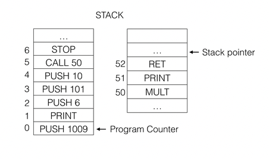

# RubyCom

This program aims at building a computer simulator with limited capabilities. 
The programs demonstrates the working of stacks at the low level.

The computer has 2 main stacks. Instruction stack and Data stack. 
Instruction stack is used to store instructions in the memory and data stack is used as a temporary storage. 
All the necessary instructions are assumed to be loaded into the instruction stack before execute is called.
Once execute is called, instructions are retrieved from the instruction stack and executed one by one until a STOP instruction is encountered.
Data stack holds the data resulting from the manipulation of instructions.

**Capabilities:**
- Load instructions
- Execute instructions
- Branches to subroutine and return back to main program when encountering return instruction

**Assumptions:**
- Instructions to be executed are loaded before calling the execute method. Instructions can be loaded by writing the instruction into load_instructions method in main.rb
- Only a limited number of instructions are supported
- This is how the stack will look like before the program gets executed
  

**Supported Instructions:**
1) **PUSH** 
 Pushes the item into the data stack and increments the stack pointer
2) **PRINT**
 Pops the item from the data stack, decrements the stack pointer, prints the popped item.
3) **MULT**
 Pops 2 items from the data stack, multiplies them and pushed the product back to the data stack
4) **CALL**
 Sets the program counter to given address in instruction stack, thereby enabling the execution of subroutine
5) **RET**
 Return from the subroutine
6) **STOP**
 Exits the program

**Pointers used in Instruction stack**
1) program_counter: Contains the index of instruction stack which contains the next instruction to be executed.
2) next_addr: Used to hold index value when loading instructions into the instruction stack.
3) return_addr: Holds the return address when branching out to subroutines.

**Pointers used in Data stack**
1) Stack pointer: Contains the index of the next available address in data stack.

**Running the program**

Program can be run by using the command:
`ruby app/main.rb`

Using docker:
`docker-compose up`

To run unit tests:
`rspec`

Using docker:
`docker-compose run rubycom bundle exec rspec`
